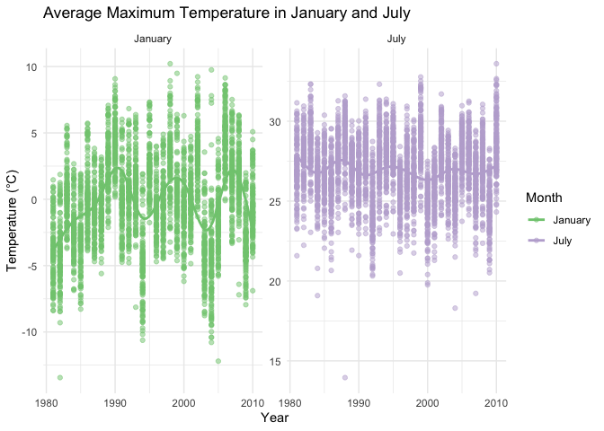
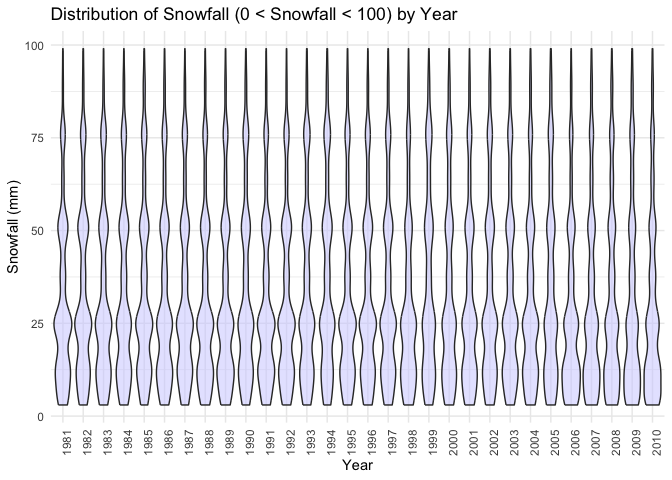
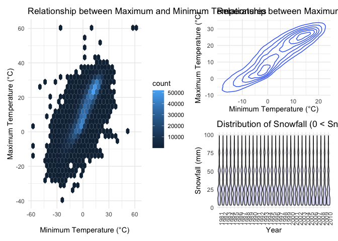

P8105 Homework 3
================
Vaiju Raja (vr2576)
2024-10-03

## Problem 1: NY NOAA

``` r
# Load the CSV file & observe the dataset
data("ny_noaa")
ny_noaa
```

    ## # A tibble: 2,595,176 × 7
    ##    id          date        prcp  snow  snwd tmax  tmin 
    ##    <chr>       <date>     <int> <int> <int> <chr> <chr>
    ##  1 US1NYAB0001 2007-11-01    NA    NA    NA <NA>  <NA> 
    ##  2 US1NYAB0001 2007-11-02    NA    NA    NA <NA>  <NA> 
    ##  3 US1NYAB0001 2007-11-03    NA    NA    NA <NA>  <NA> 
    ##  4 US1NYAB0001 2007-11-04    NA    NA    NA <NA>  <NA> 
    ##  5 US1NYAB0001 2007-11-05    NA    NA    NA <NA>  <NA> 
    ##  6 US1NYAB0001 2007-11-06    NA    NA    NA <NA>  <NA> 
    ##  7 US1NYAB0001 2007-11-07    NA    NA    NA <NA>  <NA> 
    ##  8 US1NYAB0001 2007-11-08    NA    NA    NA <NA>  <NA> 
    ##  9 US1NYAB0001 2007-11-09    NA    NA    NA <NA>  <NA> 
    ## 10 US1NYAB0001 2007-11-10    NA    NA    NA <NA>  <NA> 
    ## # ℹ 2,595,166 more rows

``` r
# The dataset includes daily weather observations from multiple stations in New York. The variables include id (station ID), date (observation date), prcp (precipitation in tenths of mm), snow (snowfall in mm), snwd (snow depth in mm), tmax (maximum temperature in tenths of degrees Celsius), & tmin (minimum temperature in tenths of degrees Celsius)

# The dataset contains 2,595,176 rows and 7 variables. However, there are substantial amounts of missing data, especially for temperature and snowfall.


# Clean dataset
ny_noaa_hw3 <- ny_noaa |>
  separate(date, into = c("year", "month", "day"), sep = "-") |>
  mutate(
    year = as.numeric(year),
    month = as.numeric(month),
    day = as.numeric(day),
    tmax = as.numeric(tmax),
    tmin = as.numeric(tmin),
    tmax = tmax / 10, # Convert max temperature to Celsius
    tmin = tmin / 10, # Convert min temperature to Celsius
    prcp = prcp / 10, # Convert precipitation to mm
    snowfall = snow / 10, # Convert snowfall to cm
    snwd = snwd / 10)


# What are the most commonly observed snowfall values? Why?
ny_noaa_hw3 |>
  group_by(snowfall) |>
  summarize(count = n()) |>
  arrange(desc(count)) |>
  head(10)
```

    ## # A tibble: 10 × 2
    ##    snowfall   count
    ##       <dbl>   <int>
    ##  1      0   2008508
    ##  2     NA    381221
    ##  3      2.5   31022
    ##  4      1.3   23095
    ##  5      5.1   18274
    ##  6      7.6   10173
    ##  7      0.8    9962
    ##  8      0.5    9748
    ##  9      3.8    9197
    ## 10      0.3    8790

``` r
# A tibble: 10 × 2
#   snowfall   count
#      <dbl>   <int>
# 1      0   2008508
# 2     NA    381221
# 3      2.5   31022
# 4      1.3   23095
# 5      5.1   18274
# 6      7.6   10173
# 7      0.8    9962
# 8      0.5    9748
# 9      3.8    9197
#10      0.3    8790

# The most common snowfall value is 0 cm, which reflects days when no snow was observed. This makes sense as snowfall is a less frequent event compared to other weather conditions.


# Two-panel plot showing average max temperature in January and July across stations
# Avg max temp by year and station for January and July
avg_temp <- ny_noaa_hw3 |>
  filter(month %in% c(1, 7)) |>
  group_by(year, id, month) |>
  summarize(avg_tmax = mean(tmax, na.rm = TRUE)) |>
  ungroup()
```

    ## `summarise()` has grouped output by 'year', 'id'. You can override using the
    ## `.groups` argument.

``` r
avg_temp$month <- factor(avg_temp$month, 
                         levels = c(1, 7), 
                         labels = c("January", "July"))

# Two-panel plot
ggplot(avg_temp, aes(x = year, y = avg_tmax, color = factor(month))) +
  geom_point(alpha = 0.5) +
  geom_smooth(se = FALSE) +
  facet_wrap(~month, scales = "free_y") +
  labs(
    title = "Average Maximum Temperature in January and July",
    x = "Year",
    y = "Temperature (°C)",
    color = "Month") +
  scale_color_brewer(palette = "Accent") + 
  theme_minimal() + 
  theme(legend.position = "right")
```

    ## `geom_smooth()` using method = 'gam' and formula = 'y ~ s(x, bs = "cs")'

    ## Warning: Removed 5970 rows containing non-finite outside the scale range
    ## (`stat_smooth()`).

    ## Warning: Removed 5970 rows containing missing values or values outside the scale range
    ## (`geom_point()`).

<!-- -->

``` r
ggsave("avg_tmax_janjuly.jpg", width = 8, height = 6, dpi = 100)
```

    ## `geom_smooth()` using method = 'gam' and formula = 'y ~ s(x, bs = "cs")'

    ## Warning: Removed 5970 rows containing non-finite outside the scale range
    ## (`stat_smooth()`).
    ## Removed 5970 rows containing missing values or values outside the scale range
    ## (`geom_point()`).

``` r
# Two-panel plot showing 
# (i) tmax vs tmin for the full dataset

# Hexagonal Heatmap
heatmap <- ggplot(ny_noaa_hw3, aes(x = tmin, y = tmax)) +
  geom_hex() +
  labs(title = "Relationship between Maximum and Minimum Temperatures", 
       x = "Minimum Temperature (°C)", 
       y = "Maximum Temperature (°C)") +
  theme_minimal()
heatmap
```

    ## Warning: Removed 1136276 rows containing non-finite outside the scale range
    ## (`stat_binhex()`).

<!-- -->

``` r
ggsave("temp_relationship_heatmap.jpg")
```

    ## Saving 7 x 5 in image

    ## Warning: Removed 1136276 rows containing non-finite outside the scale range
    ## (`stat_binhex()`).

``` r
# Density Plot
densityplot <- ggplot(ny_noaa_hw3, aes(x = tmin, y = tmax)) +  
  geom_density_2d() +
  labs(title = "Relationship between Maximum and Minimum Temperatures",
    x = "Minimum Temperature (°C)",
    y = "Maximum Temperature (°C)") +
  theme_minimal()
densityplot
```

    ## Warning: Removed 1136276 rows containing non-finite outside the scale range
    ## (`stat_density2d()`).

<!-- -->

``` r
ggsave("temp_relationship_densityplot.jpg", width = 8, height = 6, dpi = 100)
```

    ## Warning: Removed 1136276 rows containing non-finite outside the scale range
    ## (`stat_density2d()`).

``` r
# (ii) make a plot showing the distribution of snowfall values greater than 0 and less than 100 cm separately by year
snowfall_data <- ny_noaa_hw3 %>%
  filter(snow > 0, snow < 100)

# Histogram
histogram <- snowfall_data |>
  ggplot(aes(x = snowfall, fill = factor(year))) +
  geom_histogram(bins = 30, alpha = 0.7) +
  facet_wrap(~year) +
  labs(title = "Distribution of Snowfall (0 < Snowfall < 100 cm) by Year", 
       x = "Snowfall (cm)", 
       y = "Count") +
  theme_minimal()
histogram
```

<!-- -->

``` r
ggsave("snowfall_dist_histogram.jpg", width = 8, height = 6, dpi = 100)


# Violin Plot
violin_plot <- snowfall_data |>
  ggplot(aes(x = factor(year), y = snow)) +
  geom_violin(fill = "#CCCCFF", alpha = 0.5) +
  labs(
    title = "Distribution of Snowfall (0 < Snowfall < 100) by Year",
    x = "Year",
    y = "Snowfall (mm)") +
  theme_minimal() +
  theme(axis.text.x = element_text(angle = 90, hjust = 1))
violin_plot
```

<!-- -->

``` r
ggsave("snowfall_dist_violin.jpg", width = 8, height = 6, dpi = 100)


# Two-panel plot
(heatmap | violin_plot)
```

    ## Warning: Removed 1136276 rows containing non-finite outside the scale range
    ## (`stat_binhex()`).

<!-- -->

``` r
ggsave("q1_two_panel_plot.jpg", width = 8, height = 6, dpi = 100)
```

    ## Warning: Removed 1136276 rows containing non-finite outside the scale range
    ## (`stat_binhex()`).

``` r
# Three-panel plot 
(heatmap | densityplot / violin_plot)
```

    ## Warning: Removed 1136276 rows containing non-finite outside the scale range
    ## (`stat_binhex()`).

    ## Warning: Removed 1136276 rows containing non-finite outside the scale range
    ## (`stat_density2d()`).

<!-- -->

``` r
ggsave("q1_three_panel_plot.jpg", width = 8, height = 6, dpi = 100)
```

    ## Warning: Removed 1136276 rows containing non-finite outside the scale range
    ## (`stat_binhex()`).
    ## Removed 1136276 rows containing non-finite outside the scale range
    ## (`stat_density2d()`).

**What are the most commonly observed snowfall values? Why?** The most
common snowfall value is `snowfall$count` cm, which reflects days when
no snow was observed. This makes sense as snowfall is a less frequent
event compared to other weather conditions.

**Average max temperature in January and July across stations** Overall,
the average values are consistent with the expected temperatures in
January and July. However, around July 1987-1988, the average
temperature dropped to below 15˚C, which is uncommon for that month.

## Problem 2:

## Problem 3:
